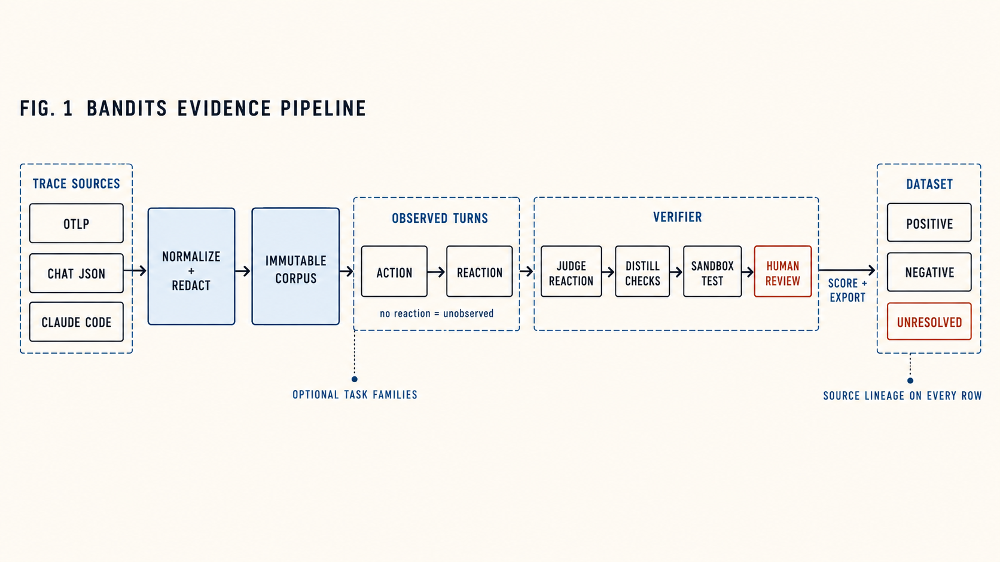
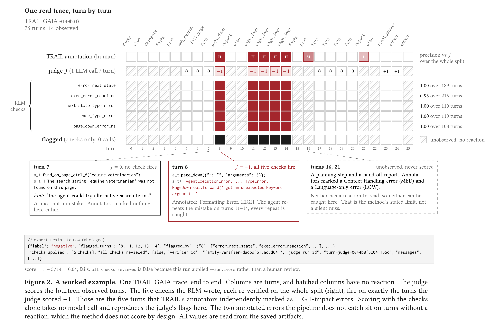
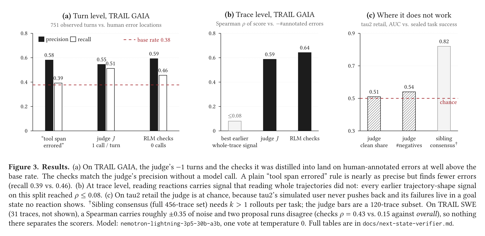

<div align="center">

# bandits

### Turn agent traces into training data you can trust.

[](https://github.com/bandr-ai/bandits/actions/workflows/quality.yml) [](https://www.python.org/downloads/) [](https://docs.astral.sh/uv/) [](https://docs.litellm.ai/docs/providers)

🚀 [Quickstart](#-quickstart) · 🔄 [Method](#-method) · 🔬 [Worked example](#-a-worked-example) · 📊 [Results](#-results) · 🧭 [Workflow](#-the-full-workflow) · 🔐 [Trust model](#-trust-is-a-data-model) · 📖 [CLI](#-cli-reference)

</div>

<picture>
  <source media="(prefers-color-scheme: dark)" srcset="docs/assets/jev-anim-dark.webp">
  
</picture>

Your agent's traces already hold the work: the request, the decisions, the tool calls, and what came back. Bandits turns that history into **labeled SFT data** and **cheap, reviewable success checks**.

The idea is one sentence long. **Judge each step by what the world did next, never by what the agent says it did.** A transcript shows the *action*, and whether the action was right usually lives in a goal state the transcript never contains. The *reaction*, meaning the tool result, the execution log, or the user's next message, is recorded, and it often says plainly whether the action worked. Bandits scores those reactions, distills the scorer into plain Python checks that a human signs off on, and exports every trace as a positive, a negative, or an explicit "can't tell". Every row carries the ids of the evidence that labeled it.

## 🎯 When to use Bandits

| You have… | You want… | Bandits gives you |
| --- | --- | --- |
| Production or benchmark agent traces (OTel, Langfuse, Claude Code, chat logs) | An SFT set of good and bad trajectories | `sft.jsonl` with positive and negative rows, plus a quarantine file for anything it could not label |
| An LLM judge that is too slow or expensive to run on every trace | A scorer with no model call per trace | Deterministic `check(turn)` predicates, distilled from the judge, re-verified on every turn, and accepted by a human |
| A dataset someone else will train on | Proof of where each label came from | Every row carries the lineage to the checks, the judge run, the verifier, and the source corpus, and says whether a human reviewed those checks |
| Verifier labels | A small, fast decision model of your own | The [Jev recipe](recipes/jev/README.md) trains one on Bandits labels and reports an honest scorecard |

## 🧩 How it fits your stack

| | Tracing / observability | LLM-as-judge evals | **Bandits** |
| --- | :---: | :---: | :---: |
| Reads OTel GenAI, OpenInference, OpenLLMetry, Langfuse | ✅ | some | ✅ |
| Judges each step, not just the final answer | — | rarely | ✅ |
| Ignores the agent's own claim of success | — | ❌ | ✅ |
| Scores new traces with no model call | — | ❌ | ✅ (accepted checks) |
| Refuses to label what it cannot confirm | — | ❌ | ✅ (`unresolved.jsonl`) |
| Exports chat-completions SFT rows with lineage | — | — | ✅ |

Bandits sits **downstream of your tracer** and **upstream of your trainer**. Keep your tracer as it is. Bandits reads what it exports.

## 🔄 Method

<p align="center">
  
</p>

The figure above shows the main flow. The steps below explain it in more detail.

**(a) Ingest.** Any supported format is normalized into a corpus $\mathcal{C}$ whose id is a hash of the normalized content and the redaction ruleset. Re-ingesting the same data yields the same id. Records that don't parse are counted as issues, never repaired by a guess. Evaluator spans never enter the corpus, so a grade cannot leak into a trajectory.

**(b) Segment.** A trace becomes a sequence of turns $t = (a_t, s_{t+1})$. The action $a_t$ is one model call, and the reaction $s_{t+1}$ is every tool result and user message recorded before the next call. A turn with nothing after it is *unobserved* and never scored. That is usually the final answer, or a planning call followed directly by another call. ([`verify/turns.py`](bandits/verify/turns.py))

**(c) Judge.** For each observed turn, an LLM judge $J$ sees the task $x$, the previous action as context, the action $a_t$ and the reaction $s_{t+1}$. It returns a one-line hint and a verdict in $\{+1, 0, -1\}$. With `--votes`, the majority wins and ties read as 0. The agent's own summary of what it did is never an input. The archetype (`support`, `coding`, `computer-use`, `generic`) changes only the paragraph telling $J$ what a bad reaction looks like in that kind of trace: a write tool rejecting a call, a traceback the agent's own code caused, a page that did not change. ([`verify/nextstate.py`](bandits/verify/nextstate.py))

**(d) Distill.** A `dspy.RLM` is shown a stratified sample of turns *with* $J$'s verdicts and hints, and writes predicates $c_k(\text{turn}) \to$ `True | False | None` in a REPL where it can test them. Nothing it says about its own predicates is kept. Every check is re-executed in an AST sandbox (no imports, no dunders, no `open` or `eval`, and no access to $J$'s verdict or hint) over **every** turn of the family. It survives only if all of these hold:

- it fired on at least $m$ judged turns (`--min-fired`),
- it fired on fewer than 80% of all turns, and
- its precision against the judge, $P(J = -1 \mid c_k = \text{True})$, is at least $\pi$ (`--min-precision`).

A second round shows the RLM what survived and why the rest did not. `review-checks` then shows a human each check's hypothesis, code, numbers and three example turns, and asks for one key: accept, reject, skip or quit. ([`verify/propose.py`](bandits/verify/propose.py))

**(e) Score and export.** Accepted checks, plus the judge unless `--no-judge`, flag turns. A trace passes when no turn is flagged: $y(\tau) = \mathbb{1}[\text{no turn flagged}]$. Its score is $1 - n_{\text{flagged}} / n_{\text{observed}}$. Passing traces become positive rows, failing ones negative rows. A trace that can't be confirmed either way goes to `unresolved.jsonl` with a reason.

**(f) Provenance.** Every step writes a new immutable artifact that names the id it was built from. Any row can therefore be walked back to the checks that fired on it, the verifier, the judge run and the corpus. A row touched by checks no human reviewed says so: `all_checks_reviewed: false`.

## 🔬 A worked example

<p align="center">
  
</p>

This is one real trace from TRAIL's GAIA split, with every value read from the saved artifacts. A search agent is asked about an exercise in a LibreTexts chemistry book.

- **Turn 7.** It searches the page for "equine veterinarian" and the tool replies *not found*. The judge scores **0**: a miss, not a mistake. Its hint suggests other search terms, and TRAIL's annotators marked nothing here either.
- **Turn 8.** It calls `page_down({"": "", "arguments": {}})`, and the tool throws `TypeError: PageDownTool.forward() got an unexpected keyword argument ''`. The judge scores **−1**.
- **Turns 11 to 14.** It repeats the same mistake four more times. Every repeat is scored −1.

The RLM, shown verdicts like these across the whole split, wrote six checks. One was refused because it did not parse. The other five survived re-execution on all 1,508 turns, at a precision against the judge of 0.95 to 1.00 over 108 to 216 judged turns each. On this trace they fire on **exactly** turns 8 and 11–14. Those are the five turns TRAIL's annotators independently marked as HIGH-impact *Formatting Errors*. Scoring with the checks alone (`--no-judge`, no model call) gives the trace 1 − 5/14 = **0.64** and a **negative** label.

The pipeline misses two annotated errors on this trace: a Context Handling error on a planning step (turn 16) and a Language-only error on a hand-off report (turn 21). Neither turn has a reaction, so neither is scored. That is the method's stated limit, and it is exactly where TRAIL's category-level recall drops (context handling 0.18 on SWE, language-only 0.18 on GAIA).

<details>
<summary><b>Reproduce it</b></summary>

<br>

```bash
# TRAIL: https://github.com/patronus-ai/trail-benchmark (data under benchmarking/)
uv sync --extra llm --extra audit
uv run bandits ingest <trail>/benchmarking/data/GAIA --source trail --project work/trail-ns
uv run bandits judge-turns <corpus-id> --archetype computer-use \
  --model accounts/fireworks/models/nemotron-lightning-3p5-30b-a3b --project work/trail-ns
uv run bandits propose-verifier <turn-judge-id> --project work/trail-ns
uv run bandits score-traces <family-verifier-id> --survivors --no-judge --project work/trail-ns
uv run python scripts/trail_nextstate_eval.py --project work/trail-ns \
  --judge-run <turn-judge-id> --scores <verifier-scores-id> \
  --trail-dir <trail>/benchmarking --split gaia --out work/trail-ns/eval-gaia.json
```

`judge-turns` and `propose-verifier` call a model, so they cost money. The ids come from each command's output. Proposal quality varies from run to run even at temperature 0, because the sample the RLM sees depends on the judge's verdicts.

</details>

## 📊 Results

<p align="center">
  
</p>

Measured on [TRAIL](https://arxiv.org/abs/2505.08638)'s human-annotated traces with `nemotron-lightning-3p5-30b-a3b`, one vote at temperature 0. Full tables for every prompt version, the SWE split and per-category recall are in [`docs/next-state-verifier.md`](docs/next-state-verifier.md).

| TRAIL GAIA · 117 traces · 751 observed turns | Turn precision | Turn recall | ρ vs. −#errors | Model calls to score |
| --- | :---: | :---: | :---: | :---: |
| Base rate | 0.38 | — | — | — |
| "Tool span errored" baseline | 0.58 | 0.39 | — | 0 |
| Next-state judge $J$ | 0.55 | **0.51** | 0.59 | 1 per turn |
| **Distilled RLM checks** | **0.59** | 0.46 | **0.64** | **0** |

What this shows:

- **Reactions carry signal that transcripts did not.** Every earlier whole-trajectory signal on this split reached ρ ≤ 0.08. The judge reaches 0.59, and the checks distilled from it reach 0.64 with no model call at scoring time.
- **Recall splits by category, as designed.** Errors a reaction can show are caught: resource abuse 0.81–0.83, tool-related 0.60–0.83, authentication and environment errors 1.0. Errors that live in the action alone are not: context handling 0.18 (SWE), language-only 0.18 (GAIA).
- **The checks are shallow on purpose, and still useful.** On GAIA the RLM wrote string matches (`'ERROR'`, `'TypeError'`, `'Error'` in the reaction). They are redundant in pairs, which is what review is for, but they match the judge at zero cost. A plain "tool span errored" rule is nearly as precise but finds fewer errors.

> [!WARNING]
> **Where it doesn't work (yet).** On tau2 retail the judge scores **AUC 0.51**, which is chance. tau2's simulated user never pushes back, and its failures (the wrong variant exchanged, the wrong order cancelled) live in a goal state no reaction shows. Support needs a corpus with real users before it can be tested at all. On TRAIL SWE, 31 traces put roughly ±0.35 of noise on a Spearman, and two proposal runs disagree (ρ 0.43 vs. 0.15), so nothing at trace level there separates the scorers. Final turns are unobserved by construction. On a benchmark the outcome grader covers them; in production the next user message or the post-session state does, when a source records them.

## 🚀 Quickstart

Bandits needs Python 3.11+ and uses [uv](https://docs.astral.sh/uv/).

```bash
git clone https://github.com/bandr-ai/bandits.git
cd bandits
uv sync                 # core: ingest, inspect, export (no model needed)
uv sync --extra llm     # add model calls (judge, review) via LiteLLM
uv sync --extra audit   # add RLM mining, check proposal and audit (DSPy + sandbox)
```

Ingest the bundled fixture and look inside. No API key is needed:

```bash
uv run bandits ingest tests/fixtures/traces.otlp.jsonl --source otlp

# The fixture deterministically produces corpus-67e49fdc2268c1e5.
uv run bandits show corpus-67e49fdc2268c1e5
uv run bandits show corpus-67e49fdc2268c1e5 --issues
```

Then go from traces to a dataset:

```bash
uv run bandits judge-turns <corpus-id> --archetype coding      # score every turn by its reaction
uv run bandits propose-verifier <judge-run-id>                 # RLM writes checks, sandbox re-verifies them
uv run bandits review-checks <family-verifier-id>              # accept / reject, one keypress each
uv run bandits score-traces <family-verifier-id>               # pass/fail and a score per trace
uv run bandits export-nextstate <verifier-scores-id> --output sft.jsonl
```

Everything is written as immutable artifacts under `.bandits/` in the project directory. Re-ingesting identical content resolves to the same id.

## 📥 Supported inputs

| Source | Flag | Expected shape |
| --- | --- | --- |
| OpenTelemetry (standard) | `--source otlp-std` | OTLP/JSON `ExportTraceServiceRequest`s (`resourceSpans`): a file, JSONL, or a directory of them |
| OpenTelemetry (flat) | `--source otlp` | One flat span object per line, `gen_ai.operation.name` of `chat` or `execute_tool` |
| Chat transcripts | `--source chat-json` | One JSON conversation or an array of conversations |
| Claude Code | `--source claude-code` | One session JSONL file or a directory of sessions |

The input format is always explicit. Bandits does not guess, because a guess risks accepting a plausible-looking misparse.

<details>
<summary><b>How <code>otlp-std</code> reads different instrumentations</b></summary>

<br>

`otlp-std` reads what an OTel exporter or collector file exporter writes. Model and tool spans are recognized from whichever convention the instrumentation declared: the OTel GenAI semantic conventions (current, older `{role, content}` message lists, and legacy `gen_ai.prompt.N.*` / span events), OpenInference, OpenLLMetry/Traceloop, or Langfuse. Messages in OpenAI, Anthropic, Gemini or LangChain shape are normalized into `gen_ai.input.messages`, and the span's own attributes are kept as-is.

A declared workflow step with no model or tool call beneath it (a retrieval, a rerank, a filter node) becomes a tool span marked `call_recorded=False`. The judge can see its result, but it is never exported as a call the model chose. Those steps are left out of SFT transcripts with a warning, and `--no-pipeline-steps` leaves them out of the corpus.

An evaluator span, and everything beneath it, never enters the corpus under any convention, so a grade cannot leak into the trajectory. Spans with no model or tool meaning are counted as `unrepresented_span` issues. Values that look like cut-off JSON are counted as `unparsed_value` and never read as message text.

</details>

## 🤖 Models and providers

Every step that calls a model (the next-state judge, direct review, RLM mining and its audit, check proposal, emulation) goes through [LiteLLM](https://docs.litellm.ai/docs/providers), so any provider it supports works. A model is `<provider>/<model>` in LiteLLM's naming. Fireworks' own `accounts/fireworks/models/...` form is also accepted and is the default.

| Model string | Needs |
| --- | --- |
| `accounts/fireworks/models/deepseek-v4p1-flash` (default) | `FIREWORKS_API_KEY` |
| `anthropic/claude-sonnet-5` | `ANTHROPIC_API_KEY` |
| `openai/gpt-5` | `OPENAI_API_KEY` |
| `hosted_vllm/<served-name>` | `HOSTED_VLLM_API_BASE`, e.g. `http://gpu:8000/v1` |
| `litellm_proxy/<name>` | `LITELLM_PROXY_API_BASE`, plus `LITELLM_PROXY_API_KEY` if the proxy asks for one |
| `ollama/<name>` | `OLLAMA_API_BASE` |

```bash
uv run bandits judge-turns <corpus-id> --archetype support --model anthropic/claude-sonnet-5
export BANDITS_MODEL=anthropic/claude-sonnet-5   # or move every stage's default at once
```

A missing key fails once, before the first request, and names the variable. Keys are read from the environment or from a `.env` in the working directory. A bare name such as `gpt-5` is refused rather than routed to a guessed provider. Artifacts and the ledger (`BANDITS_LEDGER`) record the model string as typed, and the ledger also records the provider that answered.

## 🧭 The full workflow

```bash
# 1. (Optional) Group traces into task families for family-scoped checks.
#    Skip this and the whole corpus is one family, which is what a
#    benchmark split usually is.
uv run bandits analyze <corpus-id> --tasks
uv run bandits mine-rlm <analysis-id>
uv run bandits materialize-rlm-taskset <clustering-run-id>

# 2. Score every observed turn by its reaction: the tool result, the
#    execution log, the user's next message. Never the agent's own claim.
uv run bandits judge-turns <corpus-id> --archetype computer-use \
  --task-set <task-set-id> --family <family-id>

# 3. Have an RLM propose cheap check(turn) predicates from the verdicts,
#    re-execute every one over the whole family in a sandbox, and keep
#    only what fires often enough and agrees with the judge.
uv run bandits propose-verifier <judge-run-id> --family <family-id>

# 4. Accept or reject each proposed check. One prompt each; resumable.
uv run bandits review-checks <family-verifier-id>

# 5. Apply the accepted checks, plus the judge, to every trace.
uv run bandits score-traces <family-verifier-id>

# 6. Export scored traces as labeled positive/negative SFT rows.
uv run bandits export-nextstate <verifier-scores-id> --output sft.jsonl
```

Every export also writes a sibling `<name>.unresolved.jsonl`. A trace is quarantined there with a reason, instead of vanishing or being labeled by a guess, when:

- it is missing from the corpus,
- it has no observed turns,
- its transcript cannot be rebuilt, or
- a turn could not be confirmed either way by any check or by the judge.

> [!NOTE]
> `score-traces --survivors` applies every check that cleared the automatic precision bar, including ones `review-checks` never saw. It is useful for a quick look, but every row it exports carries `all_checks_reviewed: false`, so a dataset built this way can never be mistaken for one a human actually reviewed.

<details>
<summary><b>A quicker path: direct LLM review</b></summary>

<br>

For a dataset straight from raw traces, with an LLM reviewing each candidate directly rather than turn by turn:

```bash
uv run bandits build-sft <corpus-id> --output work/direct-dataset
```

It writes `sft.jsonl`, `review.jsonl` (borderline candidates), `rejected.jsonl`, and a selection report. It is independent of the workflow above and does not use `judge-turns` or any verifier artifact.

</details>

<details>
<summary><b>Duplicates and the held-out split</b></summary>

<br>

`materialize-rlm-taskset` moves whole groups when it splits a family, so a declared retry chain never straddles fit and held-out. Lineage ids are read from the source and never inferred. If a source declares no lineage at all, every trace stays on its own.

Two traces of the same normalized request are joined as well, and the two rules compose rather than one falling back to the other. Two runs of one request from different sessions are held together even though they carry different lineage ids. A group joined by lineage on one edge and by an identical request on another moves whole. Normalization changes case and separators only and preserves identifiers and every other value, so `refund order 7741` and `refund order 8802` remain distinct.

Because whole groups move, the realized held-out share is whatever set of complete groups comes nearest the requested fraction. `judge-turns`, `propose-verifier` and `score-traces` do not read this split yet. `families <task-set-id>` shows it, and it exists so a future calibration step has a leak-safe boundary to measure across instead of inventing one after the fact.

</details>

<details>
<summary><b>What produced a grouping</b></summary>

<br>

A task set records the arm that produced it (the trace view the miner read), the model that proposed the families, and the id of the clustering run it was materialized from. Families carry no coherence figure and no similarity threshold. Nothing measured a distance, so a plausible number in those fields would be fabricated geometry. Each family's representative is its lexically first member: a real trace, chosen by a rule that cannot be mistaken for a centrality claim.

A materialized task set also records what this path cannot claim. The miner named a family and placed its members in one context, so an independent pass never checked membership.

</details>

## 🔐 Trust is a data model

Source evidence is immutable. Every interpretation is stored beside it as a new derived artifact that names the exact id it was built from:

```text
.bandits/
├── artifacts/
│   └── corpus-…/                 # normalized, redacted source (never rewritten)
│       ├── corpus.json
│       └── envelope.json
└── derived/
    ├── analysis-…/
    ├── taskset-…/
    ├── turn_judge_run-…/         # per-turn verdicts
    ├── family_verifier-…/        # proposed checks + review decisions
    ├── verifier_scores-…/        # pass/score per trace
    └── nextstate_sft_export-…/   # the dataset
```

Revising a check or re-running the judge creates a new artifact. It never rewrites what the source trace recorded.

A check's `decision` is set only by `review-checks`:

| Decision | Meaning |
| --- | --- |
| `pending` | Proposed and automatically evaluated. No human has looked at it |
| `accepted` | A reviewer confirmed it |
| `rejected` | A reviewer refused it |
| `revised` | A reviewer sent it back with feedback. A new pending check was queued from it, linked by `parent_check_id` |

`score-traces` applies only `accepted` checks by default. `--survivors` widens that to every check that cleared the precision bar, including `pending` ones, but never checks a reviewer `rejected` or `revised`. Review itself has not yet been run against the numbers in `docs/next-state-verifier.md`. `--survivors` stood in for it there, and the doc says so.

## 📦 Dataset contracts

Every SFT row, from either exporter, uses chat-completions-shaped `messages`. Assistant `tool_calls` are paired with their `tool` results and are never batched into one turn just because they share a parent span. If a trace's own record can't support rebuilding the transcript, the row is quarantined with the reason, not guessed at. This covers a tool result with no announced call, a call with no recorded result, no recorded user instruction, and user turns that don't run forward through the trajectory.

`export-nextstate` rows also carry:

- `label`: `positive` or `negative`
- `flagged_turns` and `flagged_by`: which check id, or the judge, fired on each turn
- `checks_applied` and `all_checks_reviewed`
- full lineage: `corpus_id`, `family_id`, `verifier_id`, `scores_id`, `judge_run_id`

`build-sft` also rejects a candidate for recorded tool errors or recovery paths, repeated identical tool actions, an episode long relative to its own step count, or no recorded generating model. These are demonstration-quality gates. A successful outcome alone does not make behavior worth imitating.

## 📖 CLI reference

| Command | Purpose |
| --- | --- |
| `ingest` | Normalize, redact, and store a trace export |
| `list` / `show` | Browse corpora, traces, spans, and ingest issues |
| `inspect` | Rebuild a corpus's `inspect.html`: counts, trace shapes, step trees, notes |
| `analyze` | Extract task candidates and outcome evidence |
| `mine-rlm` | Discover task families by reading raw user requests, with no embedding geometry |
| `audit-rlm` | Advisory: challenge each discovered family in a fresh adversarial context. Changes nothing |
| `materialize-rlm-taskset` / `families` | Turn a clustering run into a task set with lineage-safe fit/held-out splits, and read it back |
| `rlm-session` / `rlm-families` | Watch a running mining or audit session, and read its families as reviewable cards |
| `judge-turns` | Score every observed turn by its reaction, never by the agent's claim |
| `propose-verifier` | Have an RLM propose `check(turn)` predicates, re-execute each in a sandbox, keep the survivors |
| `review-checks` | Accept, reject, or revise each proposed check, one prompt each, resumable |
| `score-traces` | Apply accepted checks and the judge: turn flags, an unresolved list, and pass/score per trace |
| `export-nextstate` | Write scored traces as labeled positive/negative SFT rows, plus a quarantine file |
| `build-sft` | Quicker, independent path: LLM-reviewed SFT rows straight from raw traces |

Run `uv run bandits <command> --help` for every option.

## 🔒 Redaction and local state

Ingest uses the `default-v1` redaction ruleset. Use `--redaction secrets-only-v1` when email addresses are task identifiers that must be kept:

```bash
uv run bandits ingest traces.jsonl \
  --source chat-json \
  --redaction secrets-only-v1 \
  --project ./my-experiment
```

The source digest and redaction ruleset are part of corpus identity, so changing redaction produces a different content-addressed artifact. Git ignores the local `.bandits/` state and `.env` credentials. Choose or ignore export paths according to your own data-retention policy.

## 📐 Project map

```text
bandits/
├── ingest/      # OTLP, chat JSON, Claude Code and TRAIL adapters
├── analyze/     # task extraction, evidence, and RLM family discovery
├── verify/      # turns, the next-state judge, RLM-proposed checks, and their review
├── export/      # next-state SFT export, and the direct LLM-reviewed exporter
├── emulate/     # compile traces into trace-grounded environments for rollouts
├── providers.py # model strings to LiteLLM providers and their credentials
├── traces.py    # immutable canonical trace contracts
├── store.py     # content-addressed corpus and derived-artifact storage
├── redact.py    # deterministic redaction policies
└── cli.py       # Typer command-line interface

recipes/jev/     # train your own decision model on Bandits labels (separate package)
tests/           # pytest suite, mirroring the package layout
scripts/         # manual and paid runs, not collected by pytest
docs/            # design notes and measured results
```

Bandits is domain-agnostic. Coding agents, support workflows, browser automation, research, API agents, and other tool-using systems all enter through the same evidence model. Domain-specific definitions of success belong in reviewable checks, not hidden inside the trace format.

## 🛠️ Development

```bash
uv sync --extra dev
uv run ruff check .
uv run pytest --cov=bandits --cov-report=term-missing
```

The test suite injects a predictor instead of calling a model, so no credential is needed. Tests that drive LiteLLM run against a local stub server and are skipped without the `llm` extra. The suite covers ingestion fidelity, redaction, content-addressed storage, RLM task-family mining, the next-state judge and its RLM-proposed checks, and both export paths.

## 📚 Learn more

- [`docs/next-state-verifier.md`](docs/next-state-verifier.md): the design, full TRAIL and tau2 results, and what the verifier does not do
- [`docs/ingest-sources.md`](docs/ingest-sources.md) and [`docs/ingest-validation.md`](docs/ingest-validation.md): the sources and how ingestion fidelity is checked
- [`docs/rlm-task-family-mining-plan.md`](docs/rlm-task-family-mining-plan.md): task-family discovery without embeddings
- [`recipes/jev/README.md`](recipes/jev/README.md): train a decision model on Bandits labels

## 🖼️ Figures

The top pipeline figure is a [generated PNG](docs/assets/fig1-evidence-pipeline.png). Figures 2 and 3 are LaTeX (TikZ and pgfplots) sources in [`docs/figures/`](docs/figures/); their numbers come from saved artifacts listed in each `.tex` file. To rebuild their PDFs and PNGs in `docs/assets/`:

```bash
docs/figures/build.sh   # needs tectonic (or TECTONIC=/path/to/engine) and pdftocairo
```
